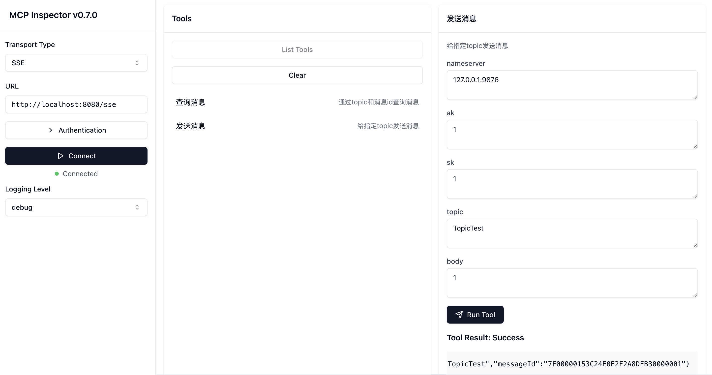
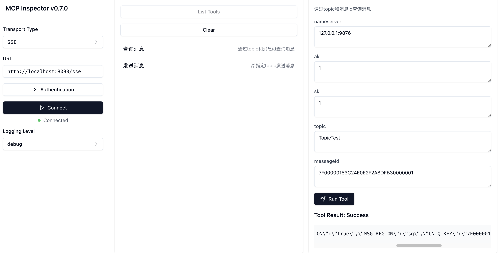

1.you can run with  `mvn spring-boot:run`

2. if you want to test it ,you can 

`npx @modelcontextprotocol/inspector`

3. then open http://localhost:5173/

connect with http://localhost:8080/sse then list tools

4. send message 

5. query message
